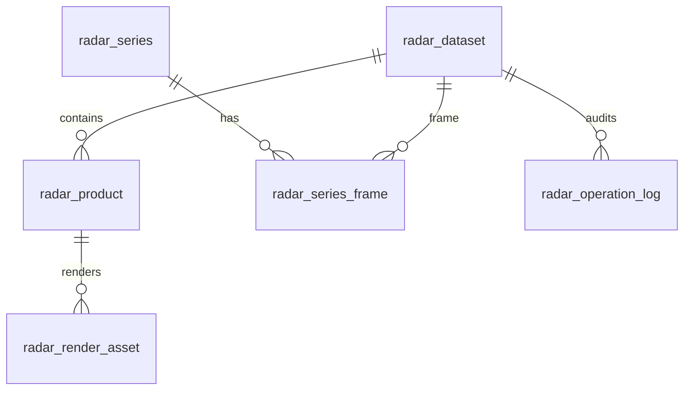

# 雷达数据表设计方案

## 1. 设计内容
- 一个 NC 文件本身的资产记录。
- 这个 NC 文件解析出来的雷达产品目录。
- 每个产品/高度层对应的 webp 渲染结果。
- 多时次雷达文件组成的序列关系。
- 增删改查、分页、排序、软删除、硬删除和操作审计。


## 2. 设计目标

- 支持雷达 NC 文件的增删改查。
- 支持分页、筛选、排序。
- 支持软删除、恢复、硬删除。
- 支持记录字段规则、字段类型和数据校验。
- 支持按产品查询，例如反射率、组合反射率、径向速度、定量降水估计、回波顶高、融化层高度。
- 支持保存 webp 渲染结果，避免每次前端访问都重新渲染。
- 支持多时次雷达序列播放。
- 支持未来接入 CINRAD、bz2、自动下载、批量导入等来源。

## 3. 数据库类型选择

推荐 MySQL 8.0 或 PostgreSQL。当前项目没有数据库层，若团队没有强约束，建议先按 MySQL 8.0 设计，原因是部署门槛低、团队接受度高、`JSON` 字段可覆盖当前 `meta.json` 扩展需求。

关键类型选择：

| 类型 | 用途 | 说明 |
|---|---|---|
| `BIGINT UNSIGNED` | 主键 | 文件、产品、渲染资产数量未来会增长，避免 `INT` 不够用。 |
| `VARCHAR(255)` | 文件名、产品名 | 足够覆盖雷达文件名和产品名。 |
| `VARCHAR(1024)` | 文件路径、URL | 本地路径和 `/data/...` URL 可能较长。 |
| `CHAR(64)` | SHA256 | 用于文件去重。 |
| `DATETIME(3)` | 时间 | 存 UTC 时间，保留毫秒，前端展示时转换。 |
| `DECIMAL(9,6)` | 经纬度 | 精度足够到亚米级，不用浮点避免比较误差。 |
| `JSON` | 扩展信息 | 保存统计值、图例、原始 meta 摘要、维度信息。 |
| `ENUM` | 状态字段 | 限制状态值，减少脏数据。 |
| `TEXT` | 错误信息、说明 | 解析错误、产品解释说明。 |

## 4. 表关系总览



## 5. 主表：`radar_dataset`

一条记录对应一个雷达 NC 文件。

| 字段 | 类型 | 必填 | 规则 | 说明 |
|---|---|---:|---|---|
| `id` | `BIGINT UNSIGNED` | 是 | 主键，自增 | 内部主键。 |
| `dataset_id` | `VARCHAR(96)` | 是 | 唯一 | 业务唯一 ID，可由文件名、时间、hash 生成。 |
| `business_type` | `VARCHAR(16)` | 是 | 默认 `Radar` | 业务类型。 |
| `file_name` | `VARCHAR(255)` | 是 | 仅文件名，不带目录 | 原始 NC 文件名。 |
| `file_ext` | `VARCHAR(16)` | 是 | 当前为 `.nc` | 文件扩展名。 |
| `file_format` | `VARCHAR(64)` | 是 | 例如 `RADAR_NC_CAP_FMT` | 解析格式。 |
| `storage_path` | `VARCHAR(1024)` | 是 | 相对路径优先 | 原始 NC 文件存储路径。 |
| `meta_path` | `VARCHAR(1024)` | 否 | 相对路径优先 | 对应 meta.json 路径。 |
| `default_webp_url` | `VARCHAR(1024)` | 否 | `/data/Radar/...webp` | 默认展示图。 |
| `file_size_bytes` | `BIGINT UNSIGNED` | 是 | 大于 0 | 文件大小。 |
| `file_hash_sha256` | `CHAR(64)` | 否 | 同文件唯一 | 用于去重。 |
| `source_origin` | `ENUM('upload','batch_import','auto_download','manual')` | 是 | 默认 `upload` | 数据来源。 |
| `radar_name` | `VARCHAR(128)` | 否 | 来自 NC attrs | 雷达名称。 |
| `radar_type` | `VARCHAR(64)` | 否 | 来自 NC attrs | 雷达类型。 |
| `institution` | `VARCHAR(128)` | 否 | 来自 NC attrs | 机构。 |
| `observed_at` | `DATETIME(3)` | 是 | UTC | 观测开始时间。 |
| `observed_end_at` | `DATETIME(3)` | 否 | UTC | 观测结束时间。 |
| `scan_seconds` | `INT UNSIGNED` | 否 | 大于 0 | 扫描间隔。 |
| `lon_min` | `DECIMAL(9,6)` | 是 | `-180 ~ 180` | 西边界。 |
| `lat_min` | `DECIMAL(9,6)` | 是 | `-90 ~ 90` | 南边界。 |
| `lon_max` | `DECIMAL(9,6)` | 是 | `lon_max > lon_min` | 东边界。 |
| `lat_max` | `DECIMAL(9,6)` | 是 | `lat_max > lat_min` | 北边界。 |
| `nx` | `INT UNSIGNED` | 是 | 大于 0 | 经向格点数。 |
| `ny` | `INT UNSIGNED` | 是 | 大于 0 | 纬向格点数。 |
| `level_count` | `INT UNSIGNED` | 是 | 默认 1 | 高度层数。 |
| `product_count` | `INT UNSIGNED` | 是 | 默认 0 | 产品数量。 |
| `default_product_code` | `VARCHAR(32)` | 否 | 例如 `DBZH` | 默认产品。 |
| `default_product_raw_name` | `VARCHAR(128)` | 否 | 例如 `observation.base_ref_cor_log` | 默认原始变量名。 |
| `status` | `ENUM('uploaded','parsing','parsed','parse_failed','rendering','rendered','disabled')` | 是 | 默认 `uploaded` | 文件处理状态。 |
| `parse_error` | `TEXT` | 否 | 失败时写入 | 解析错误。 |
| `meta_summary` | `JSON` | 否 | 禁止存完整格点数组 | meta 摘要。 |
| `created_by` | `VARCHAR(64)` | 否 | 用户 ID 或姓名 | 创建人。 |
| `updated_by` | `VARCHAR(64)` | 否 | 用户 ID 或姓名 | 更新人。 |
| `created_at` | `DATETIME(3)` | 是 | 默认当前时间 | 创建时间。 |
| `updated_at` | `DATETIME(3)` | 是 | 自动更新 | 更新时间。 |
| `deleted_at` | `DATETIME(3)` | 否 | 非空表示软删除 | 软删除时间。 |
| `deleted_by` | `VARCHAR(64)` | 否 | 删除人 | 软删除操作人。 |
| `delete_reason` | `VARCHAR(255)` | 否 | 删除原因 | 用于审计。 |

推荐索引：

```sql
UNIQUE KEY uk_radar_dataset_id (dataset_id);
UNIQUE KEY uk_radar_file_hash (file_hash_sha256);
KEY idx_radar_observed_at (observed_at);
KEY idx_radar_status_deleted (status, deleted_at);
KEY idx_radar_created_at (created_at);
KEY idx_radar_default_product (default_product_code);
KEY idx_radar_bbox (lon_min, lat_min, lon_max, lat_max);
```

## 6. 产品表：`radar_product`

一条记录对应一个 NC 文件里的一个雷达产品变量。

| 字段 | 类型 | 必填 | 规则 | 说明 |
|---|---|---:|---|---|
| `id` | `BIGINT UNSIGNED` | 是 | 主键，自增 | 内部主键。 |
| `dataset_id` | `BIGINT UNSIGNED` | 是 | 外键到 `radar_dataset.id` | 所属 NC 文件。 |
| `raw_name` | `VARCHAR(128)` | 是 | 同一文件内唯一 | 原始变量名。 |
| `product_code` | `VARCHAR(32)` | 是 | 例如 `DBZH` | 产品代码。 |
| `name_cn` | `VARCHAR(128)` | 是 | 中文名 | 例如反射率。 |
| `name_en` | `VARCHAR(128)` | 否 | 英文名 | 例如 Reflectivity。 |
| `unit` | `VARCHAR(32)` | 否 | 例如 `dBZ` | 单位。 |
| `description_zh` | `TEXT` | 否 | 面向外行 | 中文解释。 |
| `description_en` | `TEXT` | 否 | 放中文下方 | 英文解释。 |
| `selectable` | `TINYINT(1)` | 是 | 默认 0 | 是否在前端产品选择中展示。 |
| `display_order` | `INT UNSIGNED` | 是 | 越小越靠前 | 前端排序。 |
| `level_count` | `INT UNSIGNED` | 是 | 大于等于 1 | 高度层数量。 |
| `dims_json` | `JSON` | 否 | 只存维度名和 shape | 例如 `[30,755,746]`。 |
| `stats_json` | `JSON` | 否 | min/max/mean/std | 产品统计。 |
| `legend_json` | `JSON` | 否 | colors/ticks/unit | 产品色标。 |
| `render_status` | `ENUM('pending','rendered','failed')` | 是 | 默认 `pending` | 渲染状态。 |
| `render_error` | `TEXT` | 否 | 渲染失败时写入 | 错误信息。 |
| `created_at` | `DATETIME(3)` | 是 | 默认当前时间 | 创建时间。 |
| `updated_at` | `DATETIME(3)` | 是 | 自动更新 | 更新时间。 |
| `deleted_at` | `DATETIME(3)` | 否 | 产品软删除 | 一般跟随主表。 |

推荐唯一约束：

```sql
UNIQUE KEY uk_radar_product_raw (dataset_id, raw_name);
KEY idx_radar_product_code (product_code);
KEY idx_radar_product_selectable (selectable, display_order);
```

当前建议 `selectable = 1` 的前两批产品：

| 排序 | 代码 | 原始变量名 | 中文名 | 单位 |
|---:|---|---|---|---|
| 10 | `DBZH` | `observation.base_ref_cor_log` | 反射率 | `dBZ` |
| 20 | `CRF` | `observation.prdt_crf_raw_log` | 组合反射率 | `dBZ` |
| 30 | `VRAD` | `observation.base_vel_raw_lin` | 径向速度 | `m/s` |
| 40 | `QPR` | `observation.prdt_qpr_mix_lin` | 定量降水估计 | `mm/h` |
| 50 | `ETP` | `observation.prdt_etp_raw_lin` | 回波顶高 | `km` |
| 60 | `MLT` | `observation.prdt_mlt_hgt_pol` | 融化层高度 | `m` |

## 7. 渲染资产表：`radar_render_asset`

一条记录对应一个产品在一个高度层或合成层上的 webp 渲染图。

| 字段 | 类型 | 必填 | 规则 | 说明 |
|---|---|---:|---|---|
| `id` | `BIGINT UNSIGNED` | 是 | 主键，自增 | 内部主键。 |
| `dataset_id` | `BIGINT UNSIGNED` | 是 | 外键 | 所属 NC 文件。 |
| `product_id` | `BIGINT UNSIGNED` | 是 | 外键 | 所属产品。 |
| `level_key` | `VARCHAR(32)` | 是 | 例如 `max`、`level-0` | 高度层 key。 |
| `level_label` | `VARCHAR(64)` | 是 | 例如 `垂直最大值`、`1000 m` | 前端显示。 |
| `render_mode` | `ENUM('vertical_max','single_level')` | 是 | 固定枚举 | 渲染方式。 |
| `level_value` | `DECIMAL(10,3)` | 否 | 单层时填写 | 高度值。 |
| `webp_path` | `VARCHAR(1024)` | 是 | 本地相对路径 | 渲染文件路径。 |
| `webp_url` | `VARCHAR(1024)` | 是 | `/data/...webp` | 前端访问 URL。 |
| `width` | `INT UNSIGNED` | 是 | 大于 0 | 图像宽度。 |
| `height` | `INT UNSIGNED` | 是 | 大于 0 | 图像高度。 |
| `lon_min` | `DECIMAL(9,6)` | 是 | 继承主表 | 西边界。 |
| `lat_min` | `DECIMAL(9,6)` | 是 | 继承主表 | 南边界。 |
| `lon_max` | `DECIMAL(9,6)` | 是 | 继承主表 | 东边界。 |
| `lat_max` | `DECIMAL(9,6)` | 是 | 继承主表 | 北边界。 |
| `stats_json` | `JSON` | 否 | min/max/mean/std | 当前层统计。 |
| `legend_json` | `JSON` | 否 | colors/ticks/unit | 当前产品图例。 |
| `generated_at` | `DATETIME(3)` | 是 | 默认当前时间 | 生成时间。 |
| `deleted_at` | `DATETIME(3)` | 否 | 软删除 | 跟随主表或单独删除。 |

推荐唯一约束：

```sql
UNIQUE KEY uk_radar_render_level (product_id, level_key);
KEY idx_radar_render_dataset (dataset_id);
```

## 8. 序列表：`radar_series`

一条记录对应一组可播放的多时次雷达文件。

| 字段 | 类型 | 必填 | 规则 | 说明 |
|---|---|---:|---|---|
| `id` | `BIGINT UNSIGNED` | 是 | 主键，自增 | 内部主键。 |
| `series_id` | `VARCHAR(128)` | 是 | 唯一 | 序列业务 ID。 |
| `series_name` | `VARCHAR(255)` | 是 | 可自动生成 | 例如 `Radar_2025-06-01_0000_0024`。 |
| `start_observed_at` | `DATETIME(3)` | 是 | UTC | 起始时次。 |
| `end_observed_at` | `DATETIME(3)` | 是 | UTC | 结束时次。 |
| `frame_count` | `INT UNSIGNED` | 是 | 大于 0 | 帧数。 |
| `default_product_code` | `VARCHAR(32)` | 否 | 默认 DBZH | 默认播放产品。 |
| `lon_min` | `DECIMAL(9,6)` | 是 | 合并范围 | 西边界。 |
| `lat_min` | `DECIMAL(9,6)` | 是 | 合并范围 | 南边界。 |
| `lon_max` | `DECIMAL(9,6)` | 是 | 合并范围 | 东边界。 |
| `lat_max` | `DECIMAL(9,6)` | 是 | 合并范围 | 北边界。 |
| `created_at` | `DATETIME(3)` | 是 | 默认当前时间 | 创建时间。 |
| `deleted_at` | `DATETIME(3)` | 否 | 软删除 | 序列删除不一定删除原始文件。 |

## 9. 序列帧表：`radar_series_frame`

| 字段 | 类型 | 必填 | 规则 | 说明 |
|---|---|---:|---|---|
| `id` | `BIGINT UNSIGNED` | 是 | 主键，自增 | 内部主键。 |
| `series_id` | `BIGINT UNSIGNED` | 是 | 外键到 `radar_series.id` | 所属序列。 |
| `dataset_id` | `BIGINT UNSIGNED` | 是 | 外键到 `radar_dataset.id` | 对应 NC 文件。 |
| `frame_index` | `INT UNSIGNED` | 是 | 从 0 开始 | 前端播放顺序。 |
| `observed_at` | `DATETIME(3)` | 是 | UTC | 当前帧时间。 |

推荐唯一约束：

```sql
UNIQUE KEY uk_radar_series_frame_index (series_id, frame_index);
UNIQUE KEY uk_radar_series_dataset (series_id, dataset_id);
```

## 10. 操作日志表：`radar_operation_log`

用于审计增删改查中的关键写操作，尤其是软删除、恢复、硬删除。

| 字段 | 类型 | 必填 | 规则 | 说明 |
|---|---|---:|---|---|
| `id` | `BIGINT UNSIGNED` | 是 | 主键，自增 | 内部主键。 |
| `target_type` | `ENUM('dataset','product','render_asset','series')` | 是 | 固定枚举 | 操作对象类型。 |
| `target_id` | `BIGINT UNSIGNED` | 是 | 对象主键 | 操作对象 ID。 |
| `operation` | `ENUM('create','update','soft_delete','restore','hard_delete','reparse','render')` | 是 | 固定枚举 | 操作类型。 |
| `before_json` | `JSON` | 否 | 修改前摘要 | 用于回溯。 |
| `after_json` | `JSON` | 否 | 修改后摘要 | 用于回溯。 |
| `operator` | `VARCHAR(64)` | 否 | 用户 ID 或姓名 | 操作人。 |
| `reason` | `VARCHAR(255)` | 否 | 删除或修改原因 | 审计说明。 |
| `created_at` | `DATETIME(3)` | 是 | 默认当前时间 | 操作时间。 |

## 11. CRUD 规则

### 11.1 新增

新增来源包括上传、批量导入、自动下载。

流程：

1. 保存 NC 文件到 `data/Radar/`。
2. 计算 `file_size_bytes` 和 `file_hash_sha256`。
3. 检查 `file_hash_sha256` 是否已存在，避免重复导入。
4. 插入 `radar_dataset`，状态为 `uploaded`。
5. 后端解析 NC，状态改为 `parsing`。
6. 解析成功后写入 `meta_path`、空间范围、时间、产品数量等字段。
7. 插入 `radar_product`。
8. 生成 webp 后插入 `radar_render_asset`。
9. 主表状态改为 `rendered` 或 `parsed`。

### 11.2 查询

列表查询默认过滤软删除：

```sql
WHERE deleted_at IS NULL
```

常用筛选条件：

- 文件名关键词：`file_name LIKE '%keyword%'`
- 产品代码：`EXISTS radar_product.product_code = ?`
- 时间范围：`observed_at BETWEEN ? AND ?`
- 处理状态：`status IN (...)`
- 雷达类型：`radar_type = ?`
- 空间范围：bbox 相交。

### 11.3 更新

允许更新：

- 展示名称。
- 标签。
- 备注。
- 产品是否前端可选。
- 产品展示顺序。
- 产品中文/英文说明。
- 删除原因。

不建议直接更新：

- 文件大小。
- 文件 hash。
- 原始文件路径。
- 经纬度范围。
- 观测时间。
- 格点尺寸。

这些字段应通过重新解析 NC 文件来更新。

### 11.4 软删除

软删除只更新字段，不删除物理文件：

```sql
UPDATE radar_dataset
SET deleted_at = NOW(3),
    deleted_by = ?,
    delete_reason = ?
WHERE id = ?
  AND deleted_at IS NULL;
```

软删除后：

- 列表默认不显示。
- 详情接口可通过 `include_deleted=true` 查看。
- 可恢复。
- 原始 NC、meta、webp 文件暂时保留。

### 11.5 恢复

```sql
UPDATE radar_dataset
SET deleted_at = NULL,
    deleted_by = NULL,
    delete_reason = NULL
WHERE id = ?
  AND deleted_at IS NOT NULL;
```

### 11.6 硬删除

硬删除会删除数据库记录和物理文件，应只允许管理员执行。

建议规则：

- 只有已软删除的数据允许硬删除。
- 硬删除前必须检查是否被序列引用。
- 硬删除前记录 `radar_operation_log`。
- 删除顺序：`render_asset` -> `product` -> `series_frame` -> `dataset`。
- 物理文件删除包括：NC 文件、meta.json、webp 缓存目录。

## 12. 分页规则

MVP 使用普通分页：

```text
GET /api/radar/datasets?page=1&page_size=20
```

规则：

- `page` 从 1 开始。
- `page_size` 默认 20。
- `page_size` 最大 100。
- 返回 `total`、`page`、`page_size`、`items`。

返回格式：

```json
{
  "total": 1284,
  "page": 1,
  "page_size": 20,
  "items": []
}
```

后期数据量大时可增加游标分页：

```text
GET /api/radar/datasets?cursor=2025-06-01T00:24:00Z&page_size=50
```

## 13. 排序规则

前端只能传白名单字段，避免 SQL 注入。

允许排序字段：

| sort 字段 | 实际字段 | 默认方向 |
|---|---|---|
| `observed_at` | `radar_dataset.observed_at` | `desc` |
| `created_at` | `radar_dataset.created_at` | `desc` |
| `updated_at` | `radar_dataset.updated_at` | `desc` |
| `file_size` | `radar_dataset.file_size_bytes` | `desc` |
| `product_count` | `radar_dataset.product_count` | `desc` |
| `radar_name` | `radar_dataset.radar_name` | `asc` |
| `status` | `radar_dataset.status` | `asc` |

请求示例：

```text
GET /api/radar/datasets?page=1&page_size=20&sort=observed_at:desc
```

如果排序字段不在白名单，后端回退到：

```sql
ORDER BY observed_at DESC, id DESC
```

## 14. API 建议

| 方法 | 路径 | 说明 |
|---|---|---|
| `POST` | `/api/radar/datasets` | 上传或登记 NC 文件。 |
| `GET` | `/api/radar/datasets` | 分页查询雷达文件列表。 |
| `GET` | `/api/radar/datasets/{id}` | 查询单个雷达文件详情。 |
| `PATCH` | `/api/radar/datasets/{id}` | 修改备注、标签、产品展示配置。 |
| `DELETE` | `/api/radar/datasets/{id}` | 软删除。 |
| `PATCH` | `/api/radar/datasets/{id}/restore` | 恢复软删除。 |
| `DELETE` | `/api/radar/datasets/{id}/hard` | 硬删除。 |
| `GET` | `/api/radar/datasets/{id}/products` | 查询产品目录。 |
| `GET` | `/api/radar/datasets/{id}/renders` | 查询 webp 渲染资产。 |
| `POST` | `/api/radar/datasets/{id}/reparse` | 重新解析 NC。 |
| `POST` | `/api/radar/datasets/{id}/render` | 重新生成 webp。 |

## 15. 字段校验规则

### 15.1 文件规则

- 只允许 `.nc`。
- 当前只标记 `RADAR_NC_CAP_FMT` 为已实现格式。
- 文件大小必须大于 0。
- 文件 hash 重复时默认不重复入库，可返回已有记录。
- 文件路径只存相对路径或 `/data/...` 公共路径，不建议存跨机器绝对路径。

### 15.2 时间规则

- 数据库存 UTC。
- 前端显示按用户时区转换。
- 文件名时间、NC attrs 时间、meta 时间不一致时，以 NC attrs 优先。

### 15.3 空间规则

- `lon_min < lon_max`。
- `lat_min < lat_max`。
- 经度范围 `-180 ~ 180`。
- 纬度范围 `-90 ~ 90`。

### 15.4 产品规则

- `raw_name` 必须来自 NC 文件的 `observation.*` 变量。
- 同一个 dataset 内 `raw_name` 唯一。
- `selectable = 1` 的产品才进入前端左侧选择。
- 色标必须包含 `colors` 和 `ticks`。
- 产品说明从 `backend_system/docs/Radar/information.txt` 读取，并落入产品表。

### 15.5 删除规则

- 软删除不删文件。
- 恢复只恢复软删除记录。
- 硬删除需要管理员权限。
- 硬删除前必须写操作日志。
- 硬删除物理文件失败时，数据库事务应回滚或记录 `partial_failed` 状态。

## 16. 推荐建表 SQL 草案

```sql
CREATE TABLE radar_dataset (
  id BIGINT UNSIGNED NOT NULL AUTO_INCREMENT,
  dataset_id VARCHAR(96) NOT NULL,
  business_type VARCHAR(16) NOT NULL DEFAULT 'Radar',
  file_name VARCHAR(255) NOT NULL,
  file_ext VARCHAR(16) NOT NULL,
  file_format VARCHAR(64) NOT NULL,
  storage_path VARCHAR(1024) NOT NULL,
  meta_path VARCHAR(1024) NULL,
  default_webp_url VARCHAR(1024) NULL,
  file_size_bytes BIGINT UNSIGNED NOT NULL,
  file_hash_sha256 CHAR(64) NULL,
  source_origin ENUM('upload','batch_import','auto_download','manual') NOT NULL DEFAULT 'upload',
  radar_name VARCHAR(128) NULL,
  radar_type VARCHAR(64) NULL,
  institution VARCHAR(128) NULL,
  observed_at DATETIME(3) NOT NULL,
  observed_end_at DATETIME(3) NULL,
  scan_seconds INT UNSIGNED NULL,
  lon_min DECIMAL(9,6) NOT NULL,
  lat_min DECIMAL(9,6) NOT NULL,
  lon_max DECIMAL(9,6) NOT NULL,
  lat_max DECIMAL(9,6) NOT NULL,
  nx INT UNSIGNED NOT NULL,
  ny INT UNSIGNED NOT NULL,
  level_count INT UNSIGNED NOT NULL DEFAULT 1,
  product_count INT UNSIGNED NOT NULL DEFAULT 0,
  default_product_code VARCHAR(32) NULL,
  default_product_raw_name VARCHAR(128) NULL,
  status ENUM('uploaded','parsing','parsed','parse_failed','rendering','rendered','disabled') NOT NULL DEFAULT 'uploaded',
  parse_error TEXT NULL,
  meta_summary JSON NULL,
  created_by VARCHAR(64) NULL,
  updated_by VARCHAR(64) NULL,
  created_at DATETIME(3) NOT NULL DEFAULT CURRENT_TIMESTAMP(3),
  updated_at DATETIME(3) NOT NULL DEFAULT CURRENT_TIMESTAMP(3) ON UPDATE CURRENT_TIMESTAMP(3),
  deleted_at DATETIME(3) NULL,
  deleted_by VARCHAR(64) NULL,
  delete_reason VARCHAR(255) NULL,
  PRIMARY KEY (id),
  UNIQUE KEY uk_radar_dataset_id (dataset_id),
  UNIQUE KEY uk_radar_file_hash (file_hash_sha256),
  KEY idx_radar_observed_at (observed_at),
  KEY idx_radar_status_deleted (status, deleted_at),
  KEY idx_radar_created_at (created_at),
  KEY idx_radar_default_product (default_product_code),
  KEY idx_radar_bbox (lon_min, lat_min, lon_max, lat_max)
);
```

```sql
CREATE TABLE radar_product (
  id BIGINT UNSIGNED NOT NULL AUTO_INCREMENT,
  dataset_id BIGINT UNSIGNED NOT NULL,
  raw_name VARCHAR(128) NOT NULL,
  product_code VARCHAR(32) NOT NULL,
  name_cn VARCHAR(128) NOT NULL,
  name_en VARCHAR(128) NULL,
  unit VARCHAR(32) NULL,
  description_zh TEXT NULL,
  description_en TEXT NULL,
  selectable TINYINT(1) NOT NULL DEFAULT 0,
  display_order INT UNSIGNED NOT NULL DEFAULT 999,
  level_count INT UNSIGNED NOT NULL DEFAULT 1,
  dims_json JSON NULL,
  stats_json JSON NULL,
  legend_json JSON NULL,
  render_status ENUM('pending','rendered','failed') NOT NULL DEFAULT 'pending',
  render_error TEXT NULL,
  created_at DATETIME(3) NOT NULL DEFAULT CURRENT_TIMESTAMP(3),
  updated_at DATETIME(3) NOT NULL DEFAULT CURRENT_TIMESTAMP(3) ON UPDATE CURRENT_TIMESTAMP(3),
  deleted_at DATETIME(3) NULL,
  PRIMARY KEY (id),
  UNIQUE KEY uk_radar_product_raw (dataset_id, raw_name),
  KEY idx_radar_product_code (product_code),
  KEY idx_radar_product_selectable (selectable, display_order),
  CONSTRAINT fk_radar_product_dataset FOREIGN KEY (dataset_id) REFERENCES radar_dataset(id)
);
```

```sql
CREATE TABLE radar_render_asset (
  id BIGINT UNSIGNED NOT NULL AUTO_INCREMENT,
  dataset_id BIGINT UNSIGNED NOT NULL,
  product_id BIGINT UNSIGNED NOT NULL,
  level_key VARCHAR(32) NOT NULL,
  level_label VARCHAR(64) NOT NULL,
  render_mode ENUM('vertical_max','single_level') NOT NULL,
  level_value DECIMAL(10,3) NULL,
  webp_path VARCHAR(1024) NOT NULL,
  webp_url VARCHAR(1024) NOT NULL,
  width INT UNSIGNED NOT NULL,
  height INT UNSIGNED NOT NULL,
  lon_min DECIMAL(9,6) NOT NULL,
  lat_min DECIMAL(9,6) NOT NULL,
  lon_max DECIMAL(9,6) NOT NULL,
  lat_max DECIMAL(9,6) NOT NULL,
  stats_json JSON NULL,
  legend_json JSON NULL,
  generated_at DATETIME(3) NOT NULL DEFAULT CURRENT_TIMESTAMP(3),
  deleted_at DATETIME(3) NULL,
  PRIMARY KEY (id),
  UNIQUE KEY uk_radar_render_level (product_id, level_key),
  KEY idx_radar_render_dataset (dataset_id),
  CONSTRAINT fk_radar_render_dataset FOREIGN KEY (dataset_id) REFERENCES radar_dataset(id),
  CONSTRAINT fk_radar_render_product FOREIGN KEY (product_id) REFERENCES radar_product(id)
);
```

## 17. MVP 落地建议

第一阶段不必一次实现所有表，可以按以下顺序落地：

1. 先实现 `radar_dataset`，让文件列表、分页、排序、软删除可用。
2. 再实现 `radar_product`，让产品选择、产品说明、字段规则入库。
3. 再实现 `radar_render_asset`，管理 webp 渲染缓存。
4. 最后实现 `radar_series` 和 `radar_series_frame`，支撑多时次播放和批量管理。
5. `radar_operation_log` 可以和软删除/硬删除一起上线，保证审计闭环。

这样既能满足第三点任务要求，也不会一次性把当前文件型系统重构得太重。
