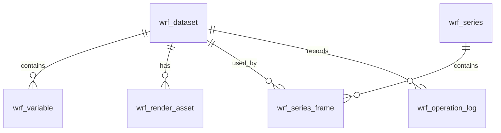

# WRF 数据表设计

这份设计只围绕当前项目里的 WRF 数据流程来写：

```text
上传 wrfout 文件
-> 保存到 data/WRF/
-> 解析 NetCDF
-> 生成 meta.json
-> 生成变量对应的 WebP 图层
-> 前端按 webp_files 展示
```

当前不再设计 PNG 和二进制格点产物，正式展示产物只保留 WebP。

## 1. 当前数据特点

WRF 文件通常长这样：

```text
wrfout_d01_2025-07-16_04_00_00
wrfout_d02_2025-07-16_04_00_00
```

其中：

- `d01`、`d02` 表示模式嵌套区域。
- 文件名后半段表示当前输出时次。
- 文件内部仍然以 NetCDF 形式保存经纬度、变量、单位、维度和时间信息。
- 当前展示层只需要把变量渲染成 WebP，并在 `meta.json` 中写入 `webp_files`。

已知示例：

| 区域 | 空间分辨率 | 网格 |
|---|---:|---:|
| `d01` | 9 km | 20 × 18 |
| `d02` | 3 km | 30 × 24 |

当前前端主要展示变量：

```text
T2, U10, V10, PSFC, PBLH, RAINC, RAINNC
```

空气质量相关变量是否开放给客户，可以后续再定：

```text
PM2_5_DRY, PM10, AOD2D_OUT
```

## 2. 建表原则

WRF 不建议一开始就把所有 NetCDF 变量和格点值都入库。原因很简单：

- 原始 wrfout 文件已经保存了完整数据。
- WebP 是前端展示产物。
- `meta.json` 已经能覆盖前端展示所需的大部分信息。
- 真正需要数据库管理的是“文件记录、变量目录、WebP 资产、时序关系、删除审计”。

所以数据库只存索引、摘要和管理字段，不存完整格点数组。

## 3. 表关系

建议先按下面这个结构设计：



MVP 阶段可以先落三张表：

```text
wrf_dataset
wrf_variable
wrf_render_asset
```

等需要后台管理多时次播放列表时，再加：

```text
wrf_series
wrf_series_frame
```

等需要删除恢复、审计追踪时，再加：

```text
wrf_operation_log
```

## 4. WRF 文件表：`wrf_dataset`

一条记录对应一个原始 WRF 文件。

这个表解决几个问题：

- 这个文件是谁上传的？
- 原始文件在哪里？
- 对应的 `meta.json` 在哪里？
- 当前是 `d01` 还是 `d02`？
- 预报时次是什么？
- 空间范围和分辨率是多少？
- 这个文件有没有解析成功？
- 是否已经被软删除？

| 字段 | 类型 | 说明 |
|---|---|---|
| `id` | `BIGINT UNSIGNED` | 主键。 |
| `dataset_id` | `VARCHAR(128)` | 业务唯一 ID。建议用文件名加 hash 生成。 |
| `business_type` | `VARCHAR(16)` | 固定为 `WRF`。 |
| `file_name` | `VARCHAR(255)` | 原始文件名，例如 `wrfout_d02_2025-07-16_04_00_00`。 |
| `storage_path` | `VARCHAR(1024)` | 原始文件路径。建议存相对路径。 |
| `meta_path` | `VARCHAR(1024)` | `meta.json` 路径。 |
| `default_webp_path` | `VARCHAR(1024)` | 默认展示图，可取第一个可展示变量的 WebP。 |
| `file_size_bytes` | `BIGINT UNSIGNED` | 文件大小。 |
| `file_hash_sha256` | `CHAR(64)` | 文件 hash，用于去重。 |
| `domain` | `VARCHAR(16)` | `d01`、`d02`、`d03` 或 `unknown`。 |
| `forecast_time` | `DATETIME(3)` | 当前输出时次。 |
| `dx_m` | `INT UNSIGNED` | x 方向分辨率，单位米。 |
| `dy_m` | `INT UNSIGNED` | y 方向分辨率，单位米。 |
| `lon_min` | `DECIMAL(9,6)` | 西边界。 |
| `lat_min` | `DECIMAL(9,6)` | 南边界。 |
| `lon_max` | `DECIMAL(9,6)` | 东边界。 |
| `lat_max` | `DECIMAL(9,6)` | 北边界。 |
| `nx` | `INT UNSIGNED` | x 方向格点数。 |
| `ny` | `INT UNSIGNED` | y 方向格点数。 |
| `display_variable_count` | `INT UNSIGNED` | 当前用于展示的变量数。 |
| `total_variable_count` | `INT UNSIGNED` | 文件内全部变量数。 |
| `webp_count` | `INT UNSIGNED` | 已生成 WebP 数量。 |
| `status` | `VARCHAR(32)` | `uploaded`、`parsing`、`parsed`、`parse_failed`、`rendered`。 |
| `parse_error` | `TEXT` | 解析失败原因。 |
| `meta_summary` | `JSON` | meta 摘要，不存完整格点。 |
| `created_by` | `VARCHAR(64)` | 创建人。 |
| `updated_by` | `VARCHAR(64)` | 更新人。 |
| `created_at` | `DATETIME(3)` | 创建时间。 |
| `updated_at` | `DATETIME(3)` | 更新时间。 |
| `deleted_at` | `DATETIME(3)` | 软删除时间。 |
| `deleted_by` | `VARCHAR(64)` | 删除人。 |
| `delete_reason` | `VARCHAR(255)` | 删除原因。 |

推荐索引：

```sql
UNIQUE KEY uk_wrf_dataset_id (dataset_id);
UNIQUE KEY uk_wrf_file_hash (file_hash_sha256);
KEY idx_wrf_domain_time (domain, forecast_time);
KEY idx_wrf_status_deleted (status, deleted_at);
KEY idx_wrf_created_at (created_at);
KEY idx_wrf_bbox (lon_min, lat_min, lon_max, lat_max);
```

去重建议：

- 优先用 `file_hash_sha256` 判断是否重复。
- 没有 hash 时，可以用 `file_name + domain + forecast_time` 做业务去重。
- 当前代码里已经做了一个轻量处理：如果重复上传生成了 `_1` 文件，WRF adapter 会识别并复用原文件结果。

## 5. WRF 变量表：`wrf_variable`

一条记录对应一个文件里的一个变量。

这个表不存变量的完整格点值，只存变量说明、单位、维度和统计摘要。

| 字段 | 类型 | 说明 |
|---|---|---|
| `id` | `BIGINT UNSIGNED` | 主键。 |
| `dataset_id` | `BIGINT UNSIGNED` | 关联 `wrf_dataset.id`。 |
| `variable_name` | `VARCHAR(64)` | 原始变量名，例如 `T2`。 |
| `name_cn` | `VARCHAR(128)` | 中文名。 |
| `name_en` | `VARCHAR(128)` | 英文名。 |
| `unit` | `VARCHAR(64)` | 单位。 |
| `description_zh` | `TEXT` | 中文说明。 |
| `description_en` | `TEXT` | 英文说明。 |
| `selectable` | `TINYINT(1)` | 是否在前端产品下拉中展示。 |
| `display_order` | `INT UNSIGNED` | 展示排序。 |
| `dims_json` | `JSON` | 维度名，例如 `["Time","south_north","west_east"]`。 |
| `shape_json` | `JSON` | shape，例如 `[1,24,30]`。 |
| `min_value` | `DECIMAL(18,6)` | 最小值。 |
| `max_value` | `DECIMAL(18,6)` | 最大值。 |
| `mean_value` | `DECIMAL(18,6)` | 平均值。 |
| `legend_json` | `JSON` | 色带、刻度和单位。 |
| `render_status` | `VARCHAR(32)` | `pending`、`rendered`、`failed`。 |
| `render_error` | `TEXT` | 渲染失败原因。 |
| `created_at` | `DATETIME(3)` | 创建时间。 |
| `updated_at` | `DATETIME(3)` | 更新时间。 |
| `deleted_at` | `DATETIME(3)` | 软删除时间。 |

推荐索引：

```sql
UNIQUE KEY uk_wrf_variable_name (dataset_id, variable_name);
KEY idx_wrf_variable_selectable (selectable, display_order);
KEY idx_wrf_variable_name (variable_name);
```

变量说明来源：

- 优先使用 `backend_system/docs/WRF/information.txt`。
- 如果说明文件里没有维护，就从 WRF 变量属性 `description`、`units`、`dimensions` 自动生成一条说明。

默认建议展示变量：

| 排序 | 变量 | 中文名 | 说明 |
|---:|---|---|---|
| 10 | `T2` | 2米气温 | 近地面温度。 |
| 20 | `U10` | 10米东西向风 | 风的东西向分量。 |
| 30 | `V10` | 10米南北向风 | 风的南北向分量。 |
| 40 | `PSFC` | 地面气压 | 模式地表气压。 |
| 50 | `PBLH` | 边界层高度 | 反映近地层混合和扩散条件。 |
| 60 | `RAINC` | 累积对流降水 | 对流过程产生的累积降水。 |
| 70 | `RAINNC` | 累积非对流降水 | 非对流云微物理过程产生的累积降水。 |

## 6. WebP 资产表：`wrf_render_asset`

一条记录对应一个变量渲染出来的一张 WebP。

当前项目中，WebP 文件会放在：

```text
data/WRF/{wrfout文件名}.webps/
```

例如：

```text
data/WRF/wrfout_d02_2025-07-16_04_00_00.webps/2025-07-16_04_00_00_T2.webp
```

| 字段 | 类型 | 说明 |
|---|---|---|
| `id` | `BIGINT UNSIGNED` | 主键。 |
| `dataset_id` | `BIGINT UNSIGNED` | 关联 `wrf_dataset.id`。 |
| `variable_id` | `BIGINT UNSIGNED` | 关联 `wrf_variable.id`。 |
| `variable_name` | `VARCHAR(64)` | 冗余字段，方便查询。 |
| `domain` | `VARCHAR(16)` | `d01`、`d02` 等。 |
| `forecast_time` | `DATETIME(3)` | 当前时次。 |
| `level_key` | `VARCHAR(64)` | 当前为 `surface_or_level_0`。 |
| `level_label` | `VARCHAR(128)` | 当前为 `地面/近地面或第0层`。 |
| `webp_path` | `VARCHAR(1024)` | 本地路径。 |
| `webp_url` | `VARCHAR(1024)` | 前端访问路径，例如 `/data/WRF/...webp`。 |
| `width` | `INT UNSIGNED` | 图像宽度。 |
| `height` | `INT UNSIGNED` | 图像高度。 |
| `lon_min` | `DECIMAL(9,6)` | 西边界。 |
| `lat_min` | `DECIMAL(9,6)` | 南边界。 |
| `lon_max` | `DECIMAL(9,6)` | 东边界。 |
| `lat_max` | `DECIMAL(9,6)` | 北边界。 |
| `min_value` | `DECIMAL(18,6)` | 当前图对应数据最小值。 |
| `max_value` | `DECIMAL(18,6)` | 当前图对应数据最大值。 |
| `mean_value` | `DECIMAL(18,6)` | 当前图对应数据平均值。 |
| `generated_at` | `DATETIME(3)` | 生成时间。 |
| `deleted_at` | `DATETIME(3)` | 软删除时间。 |

推荐索引：

```sql
UNIQUE KEY uk_wrf_render_asset (dataset_id, variable_name, level_key);
KEY idx_wrf_render_variable_time (variable_name, forecast_time);
KEY idx_wrf_render_domain_time (domain, forecast_time);
```

## 7. 时序表：`wrf_series`

这个表不是必须一开始就做。

当需要把某一天的一组 WRF 文件组织成播放序列时，再用它。

一条记录表示一组时序，例如：

```text
WRF_d02_2025-07-16_00_12
```

| 字段 | 类型 | 说明 |
|---|---|---|
| `id` | `BIGINT UNSIGNED` | 主键。 |
| `series_id` | `VARCHAR(128)` | 序列业务 ID。 |
| `series_name` | `VARCHAR(255)` | 展示名称。 |
| `domain` | `VARCHAR(16)` | 建议同一序列只放同一个 domain。 |
| `start_forecast_at` | `DATETIME(3)` | 起始时次。 |
| `end_forecast_at` | `DATETIME(3)` | 结束时次。 |
| `frame_count` | `INT UNSIGNED` | 帧数。 |
| `default_variable` | `VARCHAR(64)` | 默认播放变量。 |
| `lon_min` | `DECIMAL(9,6)` | 合并范围。 |
| `lat_min` | `DECIMAL(9,6)` | 合并范围。 |
| `lon_max` | `DECIMAL(9,6)` | 合并范围。 |
| `lat_max` | `DECIMAL(9,6)` | 合并范围。 |
| `created_at` | `DATETIME(3)` | 创建时间。 |
| `deleted_at` | `DATETIME(3)` | 软删除时间。 |

## 8. 时序帧表：`wrf_series_frame`

一条记录表示序列里的某一帧。

| 字段 | 类型 | 说明 |
|---|---|---|
| `id` | `BIGINT UNSIGNED` | 主键。 |
| `series_id` | `BIGINT UNSIGNED` | 关联 `wrf_series.id`。 |
| `dataset_id` | `BIGINT UNSIGNED` | 关联 `wrf_dataset.id`。 |
| `frame_index` | `INT UNSIGNED` | 从 0 开始。 |
| `forecast_time` | `DATETIME(3)` | 当前帧时次。 |
| `created_at` | `DATETIME(3)` | 创建时间。 |

推荐约束：

```sql
UNIQUE KEY uk_wrf_series_frame_index (series_id, frame_index);
UNIQUE KEY uk_wrf_series_dataset (series_id, dataset_id);
```

## 9. 操作日志表：`wrf_operation_log`

这个表用于记录关键写操作。

建议记录：

- 上传
- 解析
- 复用已有解析结果
- 重新解析
- 重新生成 WebP
- 软删除
- 恢复
- 硬删除

| 字段 | 类型 | 说明 |
|---|---|---|
| `id` | `BIGINT UNSIGNED` | 主键。 |
| `target_type` | `VARCHAR(32)` | `dataset`、`variable`、`render_asset`、`series`。 |
| `target_id` | `BIGINT UNSIGNED` | 对象 ID。 |
| `operation` | `VARCHAR(32)` | 操作类型。 |
| `before_json` | `JSON` | 修改前摘要。 |
| `after_json` | `JSON` | 修改后摘要。 |
| `operator` | `VARCHAR(64)` | 操作人。 |
| `reason` | `VARCHAR(255)` | 原因。 |
| `created_at` | `DATETIME(3)` | 操作时间。 |

## 10. 查询、分页和排序

列表接口建议：

```text
GET /api/wrf/datasets?page=1&page_size=20
```

分页规则：

- `page` 从 1 开始。
- `page_size` 默认 20。
- `page_size` 最大 100。
- 返回 `total`、`page`、`page_size`、`items`。

常用筛选：

| 参数 | 说明 |
|---|---|
| `keyword` | 文件名关键词。 |
| `domain` | `d01`、`d02`。 |
| `start_time` | 起始时次。 |
| `end_time` | 结束时次。 |
| `variable` | 变量名。 |
| `status` | 解析状态。 |
| `include_deleted` | 是否包含软删除数据。 |

排序字段白名单：

| sort 字段 | 实际字段 | 默认方向 |
|---|---|---|
| `forecast_time` | `wrf_dataset.forecast_time` | `desc` |
| `created_at` | `wrf_dataset.created_at` | `desc` |
| `updated_at` | `wrf_dataset.updated_at` | `desc` |
| `file_size` | `wrf_dataset.file_size_bytes` | `desc` |
| `domain` | `wrf_dataset.domain` | `asc` |
| `webp_count` | `wrf_dataset.webp_count` | `desc` |
| `status` | `wrf_dataset.status` | `asc` |

不在白名单里的排序字段直接忽略，后端回退：

```sql
ORDER BY forecast_time DESC, id DESC
```

## 11. 删除规则

### 软删除

软删除只更新数据库，不删除物理文件。

```sql
UPDATE wrf_dataset
SET deleted_at = NOW(3),
    deleted_by = ?,
    delete_reason = ?
WHERE id = ?
  AND deleted_at IS NULL;
```

软删除后：

- 默认列表不显示。
- WebP 和原始文件暂时保留。
- 可以恢复。

### 恢复

```sql
UPDATE wrf_dataset
SET deleted_at = NULL,
    deleted_by = NULL,
    delete_reason = NULL
WHERE id = ?
  AND deleted_at IS NOT NULL;
```

### 硬删除

硬删除只建议管理员使用。

硬删除内容包括：

- 原始 WRF 文件
- `.meta.json`
- `.webps/` 目录
- 数据库中的 dataset、variable、render_asset 记录

建议顺序：

```text
先写 operation_log
-> 删除 render_asset
-> 删除 variable
-> 删除 series_frame 引用
-> 删除 dataset
-> 删除物理文件
```

如果物理文件删除失败，不要静默吞掉，至少记录 `partial_failed` 状态或操作日志。

## 12. 字段校验

文件：

- 文件名建议匹配 `wrfout_dNN_YYYY-MM-DD_HH_MM_SS`。
- 文件大小必须大于 0。
- 文件 hash 重复时不重复入库。
- 路径建议存相对路径，不建议存跨机器绝对路径。

时间：

- 数据库存 UTC。
- 文件名时间和 WRF `Times` 不一致时，以 `Times` 为准。
- 时序播放按 `forecast_time` 升序。

空间：

- `lon_min < lon_max`。
- `lat_min < lat_max`。
- `dx_m > 0`。
- `dy_m > 0`。

变量：

- 变量名必须来自 WRF 文件。
- 同一个 dataset 内变量名唯一。
- `selectable = 1` 的变量才进入前端产品下拉。
- 不把完整格点数组入库。

WebP：

- 当前正式产物只使用 WebP。
- `meta.json` 只保留 `webp_files`。
- 不再使用 `png_files`、`bin_files`。

## 13. SQL 草案

下面是 MVP 可先落地的三张表。

```sql
CREATE TABLE wrf_dataset (
  id BIGINT UNSIGNED NOT NULL AUTO_INCREMENT,
  dataset_id VARCHAR(128) NOT NULL,
  business_type VARCHAR(16) NOT NULL DEFAULT 'WRF',
  file_name VARCHAR(255) NOT NULL,
  storage_path VARCHAR(1024) NOT NULL,
  meta_path VARCHAR(1024) NULL,
  default_webp_path VARCHAR(1024) NULL,
  file_size_bytes BIGINT UNSIGNED NOT NULL,
  file_hash_sha256 CHAR(64) NULL,
  domain VARCHAR(16) NOT NULL DEFAULT 'unknown',
  forecast_time DATETIME(3) NOT NULL,
  dx_m INT UNSIGNED NOT NULL,
  dy_m INT UNSIGNED NOT NULL,
  lon_min DECIMAL(9,6) NOT NULL,
  lat_min DECIMAL(9,6) NOT NULL,
  lon_max DECIMAL(9,6) NOT NULL,
  lat_max DECIMAL(9,6) NOT NULL,
  nx INT UNSIGNED NOT NULL,
  ny INT UNSIGNED NOT NULL,
  display_variable_count INT UNSIGNED NOT NULL DEFAULT 0,
  total_variable_count INT UNSIGNED NOT NULL DEFAULT 0,
  webp_count INT UNSIGNED NOT NULL DEFAULT 0,
  status VARCHAR(32) NOT NULL DEFAULT 'uploaded',
  parse_error TEXT NULL,
  meta_summary JSON NULL,
  created_by VARCHAR(64) NULL,
  updated_by VARCHAR(64) NULL,
  created_at DATETIME(3) NOT NULL DEFAULT CURRENT_TIMESTAMP(3),
  updated_at DATETIME(3) NOT NULL DEFAULT CURRENT_TIMESTAMP(3) ON UPDATE CURRENT_TIMESTAMP(3),
  deleted_at DATETIME(3) NULL,
  deleted_by VARCHAR(64) NULL,
  delete_reason VARCHAR(255) NULL,
  PRIMARY KEY (id),
  UNIQUE KEY uk_wrf_dataset_id (dataset_id),
  UNIQUE KEY uk_wrf_file_hash (file_hash_sha256),
  KEY idx_wrf_domain_time (domain, forecast_time),
  KEY idx_wrf_status_deleted (status, deleted_at),
  KEY idx_wrf_created_at (created_at)
);
```

```sql
CREATE TABLE wrf_variable (
  id BIGINT UNSIGNED NOT NULL AUTO_INCREMENT,
  dataset_id BIGINT UNSIGNED NOT NULL,
  variable_name VARCHAR(64) NOT NULL,
  name_cn VARCHAR(128) NULL,
  name_en VARCHAR(128) NULL,
  unit VARCHAR(64) NULL,
  description_zh TEXT NULL,
  description_en TEXT NULL,
  selectable TINYINT(1) NOT NULL DEFAULT 0,
  display_order INT UNSIGNED NOT NULL DEFAULT 999,
  dims_json JSON NULL,
  shape_json JSON NULL,
  min_value DECIMAL(18,6) NULL,
  max_value DECIMAL(18,6) NULL,
  mean_value DECIMAL(18,6) NULL,
  legend_json JSON NULL,
  render_status VARCHAR(32) NOT NULL DEFAULT 'pending',
  render_error TEXT NULL,
  created_at DATETIME(3) NOT NULL DEFAULT CURRENT_TIMESTAMP(3),
  updated_at DATETIME(3) NOT NULL DEFAULT CURRENT_TIMESTAMP(3) ON UPDATE CURRENT_TIMESTAMP(3),
  deleted_at DATETIME(3) NULL,
  PRIMARY KEY (id),
  UNIQUE KEY uk_wrf_variable_name (dataset_id, variable_name),
  KEY idx_wrf_variable_selectable (selectable, display_order),
  KEY idx_wrf_variable_name (variable_name)
);
```

```sql
CREATE TABLE wrf_render_asset (
  id BIGINT UNSIGNED NOT NULL AUTO_INCREMENT,
  dataset_id BIGINT UNSIGNED NOT NULL,
  variable_id BIGINT UNSIGNED NOT NULL,
  variable_name VARCHAR(64) NOT NULL,
  domain VARCHAR(16) NOT NULL DEFAULT 'unknown',
  forecast_time DATETIME(3) NOT NULL,
  level_key VARCHAR(64) NOT NULL DEFAULT 'surface_or_level_0',
  level_label VARCHAR(128) NOT NULL DEFAULT '地面/近地面或第0层',
  webp_path VARCHAR(1024) NOT NULL,
  webp_url VARCHAR(1024) NOT NULL,
  width INT UNSIGNED NOT NULL,
  height INT UNSIGNED NOT NULL,
  lon_min DECIMAL(9,6) NOT NULL,
  lat_min DECIMAL(9,6) NOT NULL,
  lon_max DECIMAL(9,6) NOT NULL,
  lat_max DECIMAL(9,6) NOT NULL,
  min_value DECIMAL(18,6) NULL,
  max_value DECIMAL(18,6) NULL,
  mean_value DECIMAL(18,6) NULL,
  generated_at DATETIME(3) NOT NULL DEFAULT CURRENT_TIMESTAMP(3),
  deleted_at DATETIME(3) NULL,
  PRIMARY KEY (id),
  UNIQUE KEY uk_wrf_render_asset (dataset_id, variable_name, level_key),
  KEY idx_wrf_render_variable_time (variable_name, forecast_time),
  KEY idx_wrf_render_domain_time (domain, forecast_time)
);
```

## 14. 当前文件产物约定

当前 WRF 解析后的文件结构建议保持为：

```text
data/WRF/
  wrfout_d02_2025-07-16_04_00_00
  wrfout_d02_2025-07-16_04_00_00.meta.json
  wrfout_d02_2025-07-16_04_00_00.webps/
    2025-07-16_04_00_00_T2.webp
    2025-07-16_04_00_00_U10.webp
    2025-07-16_04_00_00_V10.webp
```

`meta.json` 里正式使用：

```json
{
  "webp_files": []
}
```

不要再写：

```json
{
  "png_files": [],
  "bin_files": []
}
```
